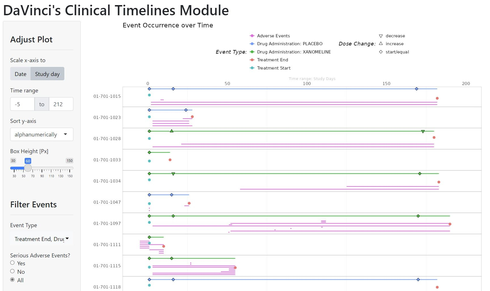

<!-- README.md is generated from README.Rmd. Please edit that file -->

# dv.clinlines

<!-- badges: start -->
<!-- badges: end -->

The Clinical Timelines module from DaVinci's {dv.clinlines} package
displays subject level data over time to
present dates and/or time intervals of pre-specified events, like
adverse events, concomitant medications, randomization dates, and more.
Events to show can be chosen as needed. Periods of drug administration
are displayed in a special way, indicating dose changes. The module
offers an overview of events of all subjects.

 <br> <br>
For adverse event data, supplementary local filters can be added. <br>
<br> The module is prepared to be used in combination with DaVinci's
{dv.manager} package and supports its bookmarking functionality. It also
allows to enable communication with other DaVinci modules for drilling
down to particular subjects (in this case, communication means to
send a unique subject ID).

## Installation

Feel free to copy the following code chunk to install the latest
version of {dv.clinlines}.

``` r
if (!require("remotes")) install.packages("remotes")
remotes::install_github("Boehringer-Ingelheim/dv.clinlines")
```

## Example

{dv.clinlines} provides a mock function to launch the module with dummy
data from the {pharmaverseadam} R package for demonstration purposes:

``` r
dv.clinlines::mock_clinical_timelines_app()
```

To launch the Clinical Timelines module with your data using {dv.manager},
add the module to your module list. The code below shows an example
definition of a one-item module list. The setup of the `mapping`
parameter concludes in a plot that shows Treatment Start and Treatment
End Points, as well as Adverse Event and Drug Administration periods.

See `vignette("clinlines")` for further information on how to use
{dv.clinlines} with {dv.manager}. Usage of helper and default
functions are also explained there.

``` r
module_list <- list(
  "Clinical Timelines" = dv.clinlines::mod_clinical_timelines(
    module_id = "mod1",
    basic_info = list(
      subject_level_dataset_name = "adsl",
      trt_start_var = "TRTSDT",
      trt_end_var = "TRTEDT",
      icf_date_var = "RFICDT"
    ),
    mapping = list(
      adsl = list(
        "Treatment Start" = list(
          start_dt_var = "TRTSDT",
          end_dt_var = NULL,
          start_dy_var = NULL,
          end_dy_var = NULL,
          detail_var = NULL
        ),
        "Treatment End" = list(
          start_dt_var = "TRTEDT",
          end_dt_var = NULL,
          start_dy_var = NULL,
          end_dy_var = NULL,
          detail_var = NULL
        )
      ),
      adae = list(
        "Adverse Events" = list(
          start_dt_var = "AESTDTC",
          end_dt_var = "AEENDTC",
          start_dy_var = NULL,
          end_dy_var = NULL,
          detail_var = "AEDECOD"
        )
      )
    ),
    drug_admin = list(
      dataset_name = "exp",
      trt_var = "EXTRT",
      start_var = "EXSTDTC",
      end_var = "EXENDTC",
      detail_var = "EXTRT",
      label = "Drug Administration",
      dose_var = "EXDOSE",
      dose_unit_var = "EXDOSU"
    )
  )
)
```
